# GTasks-CLI System Architecture Visual Diagram

```mermaid
graph TB
    %% CLI Layer
    CLI["CLI Entry Point<br/>main.py"]
    
    %% Commands Layer
    subgraph Commands["Commands Layer"]
        ADD["add.py"]
        LIST["list.py"]
        SEARCH["search.py"]
        VIEW["view.py"]
        DONE["done.py"]
        DELETE["delete.py"]
        UPDATE["update.py"]
        INTERACTIVE["interactive.py"]
        ADVANCED_SYNC["advanced_sync.py"]
        DEDUPLICATE["deduplicate.py"]
        REPORT["generate_report.py"]
        CONFIG["config.py"]
        ACCOUNT["account.py"]
        AUTH["auth.py"]
    end
    
    %% Core Layer
    subgraph Core["Core Business Logic"]
        TASK_MGR["TaskManager"]
    end
    
    %% Storage Layer
    subgraph Storage["Storage Layer"]
        CONFIG_MGR["ConfigManager"]
        SQLITE["SQLiteStorage"]
        LOCAL["LocalStorage"]
    end
    
    %% Integration Layer
    subgraph Integration["Integration Layer"]
        GTC["GoogleTasksClient"]
        GOOGLE_AUTH["GoogleAuth"]
        SYNC_MGR["SyncManager"]
        ADV_SYNC_MGR["AdvancedSyncManager"]
    end
    
    %% Models Layer
    subgraph Models["Data Models"]
        TASK_MODEL["Task Model"]
        TASKLIST_MODEL["TaskList Model"]
    end
    
    %% Reports Layer
    subgraph Reports["Reports Layer"]
        BASE_REPORT["Base Report"]
        COMPLETION_REPORT["Completion Report"]
        CREATION_REPORT["Creation Report"]
        DISTRIBUTION_REPORT["Distribution Report"]
        TIMELINE_REPORT["Timeline Report"]
        OVERDUE_REPORT["Overdue Report"]
        PENDING_REPORT["Pending Report"]
        FUTURE_REPORT["Future Timeline"]
        ORGANIZED_REPORT["Organized Tasks"]
        CUSTOM_REPORT["Custom Filtered"]
        RATE_REPORT["Completion Rate"]
    end
    
    %% Utils Layer
    subgraph Utils["Utilities Layer"]
        DT_UTILS["DateTime Utils"]
        DISPLAY["Display Utils"]
        DEDUP_UTILS["Deduplication Utils"]
        TAG_UTILS["Tag Extractor"]
        EMAIL["Email Sender"]
        LOGGER["Logger"]
        EXCEPTIONS["Exceptions"]
    end
    
    %% External Systems
    subgraph External["External Systems"]
        GOOGLE_API["Google Tasks API"]
        SMTP["SMTP Server"]
        FS["File System"]
        DB["SQLite Database"]
    end
    
    %% Main Flow Connections
    CLI --> Commands
    CLI --> TASK_MGR
    
    %% Command to TaskManager
    ADD --> TASK_MGR
    LIST --> TASK_MGR
    SEARCH --> TASK_MGR
    VIEW --> TASK_MGR
    DONE --> TASK_MGR
    DELETE --> TASK_MGR
    UPDATE --> TASK_MGR
    INTERACTIVE --> TASK_MGR
    ADVANCED_SYNC --> TASK_MGR
    DEDUPLICATE --> TASK_MGR
    REPORT --> TASK_MGR
    CONFIG --> TASK_MGR
    ACCOUNT --> TASK_MGR
    AUTH --> TASK_MGR
    
    %% TaskManager to Storage
    TASK_MGR --> Storage
    TASK_MGR --> Integration
    
    %% Storage Connections
    TASK_MGR --> CONFIG_MGR
    TASK_MGR --> SQLITE
    TASK_MGR --> LOCAL
    
    %% Integration Connections
    TASK_MGR --> GTC
    TASK_MGR --> SYNC_MGR
    TASK_MGR --> ADV_SYNC_MGR
    
    GTC --> GOOGLE_AUTH
    SYNC_MGR --> GTC
    ADV_SYNC_MGR --> GTC
    
    %% Models Connections
    TASK_MGR --> TASK_MODEL
    TASK_MGR --> TASKLIST_MODEL
    
    %% Reports Connections
    REPORT --> Reports
    REPORT --> TASK_MODEL
    
    %% Utils Connections
    LIST --> DISPLAY
    INTERACTIVE --> DISPLAY
    DEDUPLICATE --> DEDUPLICATE_UTILS
    DEDUPLICATE --> TAG_UTILS
    SYNC_MGR --> DEDUPLICATE_UTILS
    SYNC_MGR --> DT_UTILS
    REPORT --> DT_UTILS
    REPORT --> EMAIL
    ALL[".*"] --> LOGGER
    ALL[".*"] --> EXCEPTIONS
    
    %% External Connections
    GTC --> GOOGLE_API
    EMAIL --> SMTP
    CONFIG_MGR --> FS
    SQLITE --> DB
    LOCAL --> FS
    
    %% Styling
    classDef cliLayer fill:#e1f5fe
    classDef commandLayer fill:#f3e5f5
    classDef coreLayer fill:#e8f5e8
    classDef storageLayer fill:#fff3e0
    classDef integrationLayer fill:#fce4ec
    classDef modelsLayer fill:#e0f2f1
    classDef reportsLayer fill:#f1f8e9
    classDef utilsLayer fill:#fff8e1
    classDef externalLayer fill:#ffebee
    
    class CLI cliLayer
    class Commands commandLayer
    class TASK_MGR coreLayer
    class Storage storageLayer
    class Integration integrationLayer
    class Models modelsLayer
    class Reports reportsLayer
    class Utils utilsLayer
    class External externalLayer
```

## Data Flow Diagram

## Storage Architecture

## Sync Architecture

## Interactive Mode Architecture

This visual representation complements the detailed mindmap and shows:

1. **System Architecture** - How all layers connect and interact
2. **Data Flow** - The sequence of operations from user input to storage
3. **Storage Structure** - Multi-account file organization
4. **Sync Process** - Bi-directional synchronization workflow  
5. **Interactive Mode** - State machine for interactive command processing

The diagrams illustrate the modular, layered architecture that makes GTasks-CLI flexible, maintainable, and feature-rich while supporting both local and cloud-based task management.