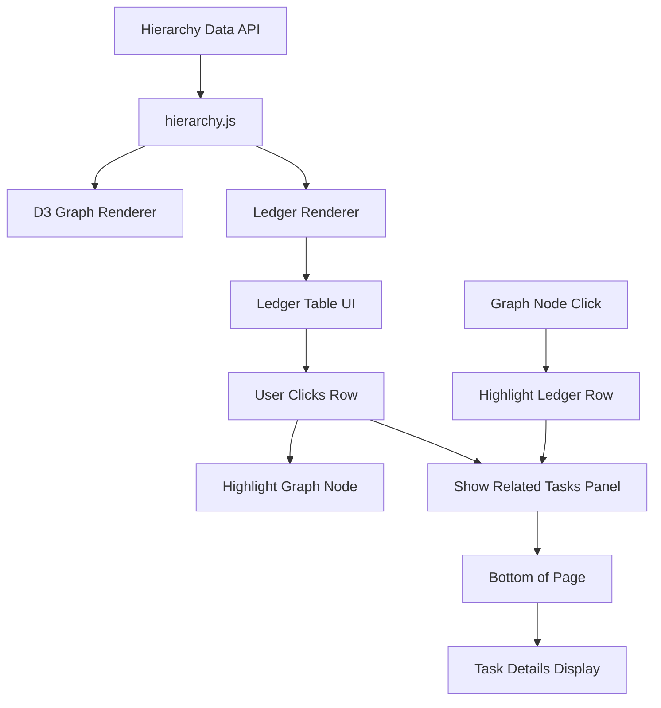

# Hierarchical Task Ledger Feature Implementation Plan

## Overview
Add a ledger (tabular) view alongside the existing D3.js graph visualization for the Hierarchical Task Visualization feature. The ledger will display node information in a table format and enable click interactions to show related tasks at the bottom of the page.

## Architecture

```
gtasks_dashboard/
├── static/
│   ├── css/
│   │   ├── hierarchy-ledger.css (NEW)
│   │   ├── hierarchy-filter.css (existing)
│   │   └── hierarchy.css (existing)
│   └── js/
│       ├── hierarchy-ledger.js (NEW)
│       ├── hierarchy.js (modify)
│       ├── hierarchy-renderer.js (existing)
│       ├── hierarchy-interactions.js (existing)
│       ├── hierarchy-task-panel.js (existing)
│       └── hierarchy-filters.js (existing)
└── templates/
    └── dashboard.html (modify)
```

## Feature Specifications

### 1. Ledger Display Requirements

**Table Columns:**
- Node Name
- Node Type (Priority/Category/Tag/Account)
- Priority Level (for priority nodes)
- Task Count
- Status Distribution (pending/completed)
- Related Tags/Accounts

**Visual Features:**
- Alternating row colors
- Hover effects
- Selected row highlighting (syncs with graph)
- Color-coded type indicators
- Sortable columns
- Search filter input
- Pagination (if needed)

### 2. Interaction Requirements

**Click Behavior:**
- Click row → Highlight corresponding node in D3 graph
- Click row → Load and display related tasks in bottom panel
- Click row → Update URL hash for deep linking (optional)

**Synchronization:**
- Graph node hover → Highlight corresponding ledger row
- Ledger row click → Highlight corresponding graph node
- Filter changes → Update both graph and ledger
- View toggle → Switch between graph/ledger/split views

### 3. Related Tasks Panel

**Location:** Bottom of page (below graph area)
**Content:** Same as existing task panel but specific to selected ledger node
**Features:**
- Task cards with full details
- Filter/sort options
- Expandable notes
- Tags display
- Status badges

## Implementation Steps

### Step 1: Create CSS (hierarchy-ledger.css)

```css
/* Main ledger panel */
.ledger-panel {
    background: white;
    border-radius: 8px;
    box-shadow: 0 2px 8px rgba(0,0,0,0.1);
    margin: 16px 0;
    overflow: hidden;
}

.ledger-header {
    padding: 12px 16px;
    background: linear-gradient(135deg, #f0f9ff 0%, #e0f2fe 100%);
    border-bottom: 1px solid #bae6fd;
    display: flex;
    justify-content: space-between;
    align-items: center;
}

.ledger-title {
    font-size: 14px;
    font-weight: 600;
    color: #0369a1;
}

.ledger-search {
    padding: 6px 12px;
    border: 1px solid #7dd3fc;
    border-radius: 6px;
    font-size: 13px;
    min-width: 200px;
}

/* Table styles */
.ledger-table {
    width: 100%;
    border-collapse: collapse;
}

.ledger-th {
    padding: 10px 12px;
    text-align: left;
    font-size: 12px;
    font-weight: 600;
    color: #0369a1;
    text-transform: uppercase;
    background: #f8fafc;
    border-bottom: 2px solid #e2e8f0;
    cursor: pointer;
    user-select: none;
}

.ledger-th:hover {
    background: #e0f2fe;
}

.ledger-td {
    padding: 10px 12px;
    font-size: 13px;
    border-bottom: 1px solid #e2e8f0;
    color: #374151;
}

.ledger-row {
    cursor: pointer;
    transition: background 0.15s ease;
}

.ledger-row:hover {
    background: #f1f5f9;
}

.ledger-row.selected {
    background: #dbeafe;
    border-left: 3px solid #3b82f6;
}

/* Type badges */
.type-badge {
    display: inline-block;
    padding: 2px 8px;
    border-radius: 12px;
    font-size: 11px;
    font-weight: 500;
}

.type-badge.priority { background: #fef3c7; color: #92400e; }
.type-badge.category { background: #dbeafe; color: #1e40af; }
.type-badge.tag { background: #d1fae5; color: #065f46; }
.type-badge.account { background: #ede9fe; color: #5b21b6; }

/* Priority indicators */
.priority-dot {
    display: inline-block;
    width: 8px;
    height: 8px;
    border-radius: 50%;
    margin-right: 6px;
}

.priority-dot.critical { background: #ef4444; }
.priority-dot.high { background: #f97316; }
.priority-dot.medium { background: #eab308; }
.priority-dot.low { background: #6b7280; }

/* Status pills */
.status-pills {
    display: flex;
    gap: 4px;
}

.status-pill {
    padding: 2px 6px;
    border-radius: 4px;
    font-size: 10px;
    font-weight: 500;
}

.status-pill.pending { background: #fef3c7; color: #92400e; }
.status-pill.completed { background: #d1fae5; color: #065f46; }

/* View toggle */
.view-toggle {
    display: flex;
    gap: 4px;
}

.view-btn {
    padding: 6px 12px;
    border: 1px solid #d1d5db;
    border-radius: 6px;
    font-size: 12px;
    background: white;
    cursor: pointer;
    transition: all 0.2s ease;
}

.view-btn.active {
    background: #3b82f6;
    color: white;
    border-color: #3b82f6;
}

/* Related tasks panel for ledger */
#ledger-tasks-panel {
    margin-top: 16px;
    border-radius: 8px;
    box-shadow: 0 2px 8px rgba(0,0,0,0.1);
}

#ledger-tasks-panel .task-panel-header {
    display: flex;
    justify-content: space-between;
    align-items: center;
    padding: 12px 16px;
    background: linear-gradient(135deg, #f0f9ff 0%, #e0f2fe 100%);
    border-bottom: 1px solid #bae6fd;
}

#ledger-tasks-panel .close-btn {
    background: none;
    border: none;
    font-size: 18px;
    cursor: pointer;
    color: #6b7280;
}
```

### Step 2: Create JavaScript Module (hierarchy-ledger.js)

```javascript
/**
 * Hierarchy Ledger Module
 * Handles tabular display of hierarchy nodes with click interactions
 */

// State
let ledgerData = [];
let selectedLedgerNode = null;
let sortColumn = 'name';
let sortDirection = 'asc';
let searchQuery = '';

/**
 * Render ledger from hierarchy data
 */
export function renderLedger(data) {
    console.log('[HierarchyLedger] Rendering ledger with data:', data);
    ledgerData = data.nodes || [];
    
    const container = document.getElementById('ledger-panel');
    if (!container) {
        console.error('[HierarchyLedger] Ledger panel container not found');
        return;
    }
    
    // Apply filters and sorting
    let filteredData = filterLedgerData(ledgerData);
    filteredData = sortLedgerData(filteredData);
    
    // Generate table HTML
    container.innerHTML = generateLedgerTable(filteredData);
    
    // Setup event listeners
    setupLedgerEventListeners();
}

/**
 * Generate ledger table HTML
 */
function generateLedgerTable(data) {
    if (!data || data.length === 0) {
        return `
            <div class="ledger-empty">
                <p style="text-align: center; color: #6b7280; padding: 20px;">
                    No nodes to display. Load hierarchy data first.
                </p>
            </div>
        `;
    }
    
    const rows = data.map(node => generateLedgerRow(node)).join('');
    
    return `
        <div class="ledger-header">
            <div class="ledger-title">Hierarchy Ledger</div>
            <input type="text" id="ledger-search" class="ledger-search" 
                   placeholder="Search nodes..." value="${escapeHtml(searchQuery)}">
        </div>
        <table class="ledger-table">
            <thead>
                <tr>
                    <th class="ledger-th" data-sort="name">Name</th>
                    <th class="ledger-th" data-sort="type">Type</th>
                    <th class="ledger-th" data-sort="priority">Priority</th>
                    <th class="ledger-th" data-sort="count">Task Count</th>
                    <th class="ledger-th" data-sort="status">Status</th>
                </tr>
            </thead>
            <tbody id="ledger-tbody">
                ${rows}
            </tbody>
        </table>
        <div class="ledger-footer" style="padding: 8px 16px; background: #f8fafc; border-top: 1px solid #e2e8f0; font-size: 12px; color: #6b7280;">
            ${data.length} node(s) displayed
        </div>
    `;
}

/**
 * Generate single ledger row
 */
function generateLedgerRow(node) {
    const typeClass = node.type || 'default';
    const typeLabel = capitalizeFirst(node.type || 'unknown');
    const priorityDot = node.priority ? 
        `<span class="priority-dot ${node.priority}"></span>` : '';
    const priorityLabel = node.priority ? 
        capitalizeFirst(node.priority) : '-';
    const taskCount = node.val || 0;
    
    // Calculate status distribution (placeholder - would need actual task data)
    const statusHtml = `
        <div class="status-pills">
            <span class="status-pill pending">${taskCount} pending</span>
        </div>
    `;
    
    const isSelected = selectedLedgerNode && selectedLedgerNode.id === node.id;
    const selectedClass = isSelected ? 'selected' : '';
    
    return `
        <tr class="ledger-row ${selectedClass}" data-node-id="${node.id}">
            <td class="ledger-td">
                <strong>${escapeHtml(node.name || node.id)}</strong>
            </td>
            <td class="ledger-td">
                <span class="type-badge ${typeClass}">${typeLabel}</span>
            </td>
            <td class="ledger-td">
                ${priorityDot}${priorityLabel}
            </td>
            <td class="ledger-td">${taskCount}</td>
            <td class="ledger-td">${statusHtml}</td>
        </tr>
    `;
}

/**
 * Setup event listeners
 */
function setupLedgerEventListeners() {
    // Search input
    const searchInput = document.getElementById('ledger-search');
    if (searchInput) {
        searchInput.addEventListener('input', function() {
            searchQuery = this.value.trim();
            renderLedger({ nodes: ledgerData });
        });
    }
    
    // Column sorting
    document.querySelectorAll('.ledger-th').forEach(th => {
        th.addEventListener('click', function() {
            const column = this.dataset.sort;
            if (sortColumn === column) {
                sortDirection = sortDirection === 'asc' ? 'desc' : 'asc';
            } else {
                sortColumn = column;
                sortDirection = 'asc';
            }
            renderLedger({ nodes: ledgerData });
        });
    });
    
    // Row clicks
    document.querySelectorAll('.ledger-row').forEach(row => {
        row.addEventListener('click', function() {
            const nodeId = this.dataset.nodeId;
            const node = ledgerData.find(n => n.id === nodeId);
            if (node) {
                handleLedgerClick(node);
            }
        });
    });
}

/**
 * Handle ledger row click
 */
function handleLedgerClick(node) {
    console.log('[HierarchyLedger] Row clicked:', node);
    selectedLedgerNode = node;
    
    // Update row selection
    document.querySelectorAll('.ledger-row').forEach(r => {
        r.classList.remove('selected');
    });
    const selectedRow = document.querySelector(`.ledger-row[data-node-id="${node.id}"]`);
    if (selectedRow) {
        selectedRow.classList.add('selected');
    }
    
    // Highlight corresponding graph node
    if (typeof window.highlightSelectedNode === 'function') {
        window.highlightSelectedNode(node);
    }
    
    // Show related tasks in bottom panel
    showLedgerTasksPanel(node);
}

/**
 * Show related tasks panel for selected ledger node
 */
function showLedgerTasksPanel(node) {
    let panel = document.getElementById('ledger-tasks-panel');
    
    if (!panel) {
        // Create panel if it doesn't exist
        panel = document.createElement('div');
        panel.id = 'ledger-tasks-panel';
        panel.className = 'task-panel';
        
        // Insert after the visualization container
        const vizContainer = document.getElementById('hierarchy-viz-container');
        if (vizContainer) {
            vizContainer.parentNode.insertBefore(panel, vizContainer.nextSibling);
        }
    }
    
    // Set header
    panel.innerHTML = `
        <div class="task-panel-header">
            <h3 id="ledger-selected-node-title">Tasks for: ${escapeHtml(node.name || node.id)}</h3>
            <button class="close-btn" onclick="closeLedgerTasksPanel()">×</button>
        </div>
        <div id="ledger-node-tasks-grid" class="task-panel-content" 
             style="padding: 16px; max-height: 400px; overflow-y: auto;">
            <p style="text-align: center; color: #6b7280;">Loading tasks...</p>
        </div>
    `;
    
    panel.style.display = 'block';
    
    // Load related tasks
    if (typeof window.loadNodeTasksHierarchy === 'function') {
        window.loadNodeTasksHierarchy(node);
    }
}

/**
 * Close ledger tasks panel
 */
export function closeLedgerTasksPanel() {
    const panel = document.getElementById('ledger-tasks-panel');
    if (panel) {
        panel.style.display = 'none';
    }
    selectedLedgerNode = null;
    
    // Remove row selection
    document.querySelectorAll('.ledger-row').forEach(r => {
        r.classList.remove('selected');
    });
}

/**
 * Filter ledger data based on search query
 */
function filterLedgerData(data) {
    if (!searchQuery) return data;
    
    const query = searchQuery.toLowerCase();
    return data.filter(node => {
        return (node.name || '').toLowerCase().includes(query) ||
               (node.type || '').toLowerCase().includes(query) ||
               (node.priority || '').toLowerCase().includes(query);
    });
}

/**
 * Sort ledger data
 */
function sortLedgerData(data) {
    return [...data].sort((a, b) => {
        let aVal = a[sortColumn];
        let bVal = b[sortColumn];
        
        if (sortColumn === 'name') {
            aVal = (aVal || '').toString().toLowerCase();
            bVal = (bVal || '').toString().toLowerCase();
        }
        
        if (aVal < bVal) return sortDirection === 'asc' ? -1 : 1;
        if (aVal > bVal) return sortDirection === 'asc' ? 1 : -1;
        return 0;
    });
}

/**
 * Update ledger when hierarchy filters change
 */
export function updateLedgerWithFilters(hierarchyData) {
    ledgerData = hierarchyData.nodes || [];
    renderLedger({ nodes: ledgerData });
}

/**
 * Clear ledger selection
 */
export function clearLedgerSelection() {
    selectedLedgerNode = null;
    closeLedgerTasksPanel();
}

// Utility functions
function escapeHtml(text) {
    if (!text) return '';
    const div = document.createElement('div');
    div.textContent = text;
    return div.innerHTML;
}

function capitalizeFirst(str) {
    if (!str) return '';
    return str.charAt(0).toUpperCase() + str.slice(1);
}

// Export for global use
window.renderLedger = renderLedger;
window.closeLedgerTasksPanel = closeLedgerTasksPanel;
window.updateLedgerWithFilters = updateLedgerWithFilters;
window.clearLedgerSelection = clearLedgerSelection;
```

### Step 3: Modify hierarchy.js

Add ledger imports and integration:

```javascript
// Add import at top
import { renderLedger, updateLedgerWithFilters, closeLedgerTasksPanel, clearLedgerSelection } from './hierarchy-ledger.js';

// Add to exports
export {
    renderLedger,
    updateLedgerWithFilters,
    closeLedgerTasksPanel,
    clearLedgerSelection,
    // ... existing exports
};

// Modify renderHierarchy to also render ledger
export function renderHierarchy(data) {
    console.log('[Hierarchy] renderHierarchy called with data:', data);
    window.hierarchyData = data;
    initHierarchy();
    
    // Also render ledger
    renderLedger(data);
}

// Modify refreshHierarchyVisualization to update ledger
export async function refreshHierarchyVisualization() {
    // ... existing code ...
    
    // Update ledger after filtering
    updateLedgerWithFilters(hierarchyData);
}
```

### Step 4: Modify dashboard.html

Add ledger panel container and related tasks panel location:

```html
<!-- Add before hierarchy visualization -->
<div id="ledger-panel" class="ledger-panel" style="display: none;">
    <!-- Generated by hierarchy-ledger.js -->
</div>

<!-- Add view toggle buttons in filter panel -->
<div class="hierarchy-filter-panel">
    <!-- Existing filters -->
    <div class="view-toggle">
        <button class="view-btn active" data-view="graph" onclick="switchHierarchyView('graph')">Graph</button>
        <button class="view-btn" data-view="ledger" onclick="switchHierarchyView('ledger')">Ledger</button>
        <button class="view-btn" data-view="both" onclick="switchHierarchyView('both')">Both</button>
    </div>
</div>

<!-- Hierarchy visualization (existing) -->
<div id="hierarchy-viz-container">
    <svg id="hierarchy-viz"></svg>
</div>

<!-- Related tasks panel for ledger (will be created by JS) -->
<div id="ledger-tasks-panel" class="task-panel" style="display: none;">
    <!-- Generated by hierarchy-ledger.js -->
</div>
```

Add view switching function in dashboard.html script:

```javascript
function switchHierarchyView(view) {
    const ledgerPanel = document.getElementById('ledger-panel');
    const vizContainer = document.getElementById('hierarchy-viz-container');
    
    // Update buttons
    document.querySelectorAll('.view-btn').forEach(btn => {
        btn.classList.remove('active');
        if (btn.dataset.view === view) {
            btn.classList.add('active');
        }
    });
    
    // Update visibility
    switch(view) {
        case 'graph':
            ledgerPanel.style.display = 'none';
            vizContainer.style.display = 'block';
            break;
        case 'ledger':
            ledgerPanel.style.display = 'block';
            vizContainer.style.display = 'none';
            break;
        case 'both':
            ledgerPanel.style.display = 'block';
            vizContainer.style.display = 'block';
            break;
    }
    
    // Save preference
    localStorage.setItem('hierarchyView', view);
}

// Load saved preference
const savedView = localStorage.getItem('hierarchyView') || 'graph';
if (savedView) {
    switchHierarchyView(savedView);
}
```

## Data Flow Diagram



## User Experience

### Default State
- Graph view active
- Ledger hidden (can be toggled)
- Filters affect both views

### After Clicking Ledger Row
1. Corresponding graph node highlights
2. Bottom panel opens with related tasks
3. Row stays selected in ledger
4. Can close panel by clicking X

### Filter Behavior
- Search in ledger filters both views
- Filters in filter panel update both views
- Clear filters restores all nodes

## Testing Checklist

- [ ] Ledger displays correct data from hierarchy API
- [ ] Clicking row highlights corresponding graph node
- [ ] Related tasks panel shows correct tasks for node
- [ ] Column sorting works
- [ ] Search filtering works
- [ ] View toggle switches between graph/ledger/both
- [ ] Synchronization between ledger and graph works both ways
- [ ] CSS styling matches existing design
- [ ] Responsive layout works on different screen sizes
- [ ] No console errors

## Files to Create/Modify

**Create:**
- `gtasks_dashboard/static/css/hierarchy-ledger.css`
- `gtasks_dashboard/static/js/hierarchy-ledger.js`

**Modify:**
- `gtasks_dashboard/static/js/hierarchy.js`
- `gtasks_dashboard/templates/dashboard.html`

## Dependencies

- D3.js (already loaded)
- Existing hierarchy modules (hierarchy.js, hierarchy-interactions.js, hierarchy-task-panel.js)
- No new external dependencies required
